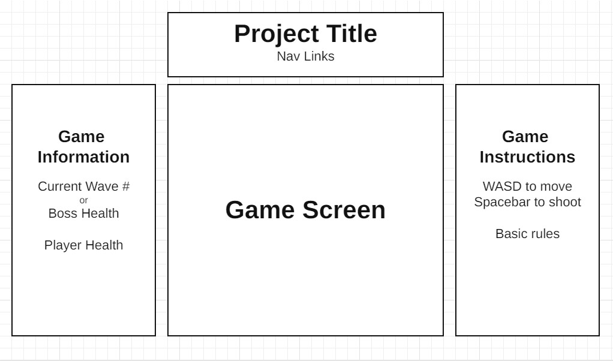

# Galactic Defender

## Background

Galactic Defender is a galaxy shooter game, based off the classic [Space Invaders](https://en.wikipedia.org/wiki/Space_Invaders) and [Galaga](https://en.wikipedia.org/wiki/Galaga) games. The core gameplay is the player is a ship that moves around in a fixed 2d screen and shoots down enemy ships/aliens, while also avoiding enemy projectiles and colliding with the enemies themselves. While there are various iterations on the gameplay loop, in Galactic Defender the player's goal is to survive waves of enemies and defeat the boss at the end without losing all their health points (HP), otherwise it's game over. Enemies also have their own HP that must be depleted in order to be destroyed.

## Functionality & MVPs

* The player can move anywhere across the game screen using WASD keys and can shoot projectiles with spacebar.
* All enemies spawn in from the top of the game screen, move from top to bottom, and shoot projectiles.
* A wave consists of around 10-20 enemies, and all must either be destroyed or have moved off the screen to get to the next wave.
* The final boss spawns in after 10 waves, and will be a giant ship moving along the top of the screen with multiple shooting patterns, and has alot more HP compared to normal enemies.
* Start game screen, and an end game screen for game over or winning.
* Player can retry on win or lose.

## Wireframe

* Nav links include a link to this project's Github repo and my LinkedIn.
* Game instructions include basic controls and any rules about the game.
* Game information will dynamically be updated with the current state of the game.
* Game screen will be a Canvas element that renders the actual gameplay.

## Technologies, Libraries, APIs

* This project will be written with HTML, CSS, and JavaScript.
* Canvas API to render the game.
* npm to manage project dependencies.
* Webpack to bundle the source JavaScript files.

## Implementation Timeline

* Thursday (March 11):
  * Planning and research. Setup project, work on setting up the HTML page and Canvas game screen.
* Friday Afternoon & Weekend (March 10-12):
  * Finishing up the webpage. Completing minimum gameplay functionalities.
* Monday (March 13):
  * Complete starting and end game screen, views, logic, and transitions.
* Tuesday (March 14):
  * Polishing up the minimal product, and start working on extra features.
* Wednesday (March 15):
  * Continue working on extra features.
* Thursday Morning (March 16):
  * Polish and deploy product.
* Afterwards:
  * Continue Working on bonus features and extra implementations.

## Bonus features

* Music and sound effects, with the option to mute.
* Player can collect upgrades, dropped randomly from destroyed enemies, that will improve their shooting pattern and damage.
* Enemy variety with different movement and shooting patterns.
* Indestructable obstacles like asteroids that the player must avoid.
* Multiple levels with different backgrounds and final bosses. Player must then beat all levels to win the game.
* Player can also control the ship with mouse movements and shoot with left click.
