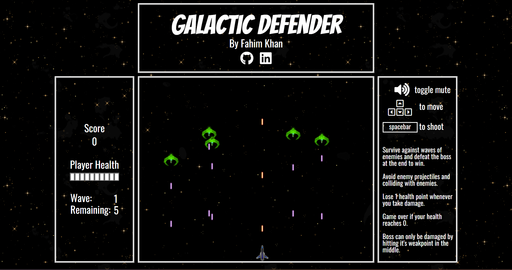
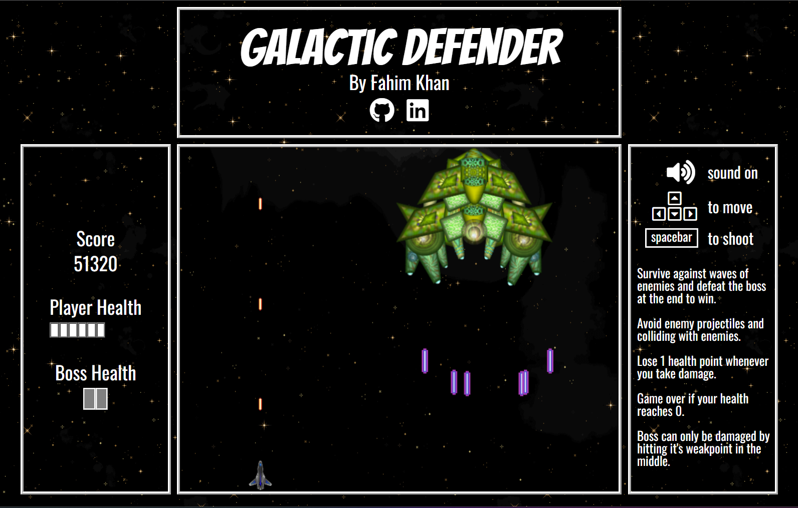
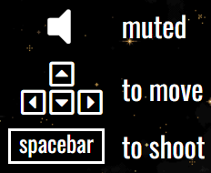

# Galactic Defender

## [Click here to play](https://fk652.github.io/Galactic-Defender/)

___

## Background

___

Galactic Defender is a galaxy shooter game, based off the classic [Space Invaders](https://en.wikipedia.org/wiki/Space_Invaders) and [Galaga](https://en.wikipedia.org/wiki/Galaga) games. The main gameplay involves the player controlling a ship that moves around in a fixed 2d screen and shoots down enemy ships/aliens, while also avoiding enemies and their projectiles.

In Galactic Defender the player's goal is to survive waves of enemies.



...and defeat the boss at the end.



It's game over if the player loses all their health points (HP) before defeating the boss. Enemies also have their own HP that must be depleted to be destroyed, with scaling difficulty.

## Instructions

___

Controls are simply arrow keys (or WASD) to move in any direction, spacebar (or left click) to shoot (can be held down to continously shoot), and a clickable toggle mute button.



## Functionality & MVPs

___

* [x] The player can move anywhere across the game screen using WASD or arrow keys and can shoot projectiles with spacebar or left click.
* [x] All enemies spawn in from the top of the game screen, move from top to bottom, and shoot projectiles.
* [x] Waves of around 5-20 enemies, and all must either be destroyed or have moved off the screen to get to the next wave.
* [x] Boss spawns in after 5 waves, and will be a giant ship moving along the top of the screen with multiple phases of shooting patterns, and has alot more HP compared to normal enemies.
* [x] Start game screen, game over screen, and win screen.
* [x] Player can retry on win or lose.

## How the game is being rendered

___

The GameView animate function updates and draws the current state of the game on canvas using requestAnimationFrame

```javascript
class GameView {

  ...

  animate(time) {
    if (this.game.startScreen || this.game.gameOver || this.game.win) {
      if (this.pause) this.handlePauseToggle();
      this.drawStartWinGameOver();
    } else if (!this.pause) {
      this.updateInformation();
      this.draw();
      const timeDelta = time - this.lastTime;
      this.game.step(timeDelta);
    }

    this.lastTime = time;
    requestAnimationFrame(this.animate.bind(this));
  }

  draw() {
    this.ctx.clearRect(0, 0, this.canvasWidth, this.canvasHeight);
    this.drawBackground();

    for (let key in this.game.allMovingObjects) {
      Object.values(this.game.allMovingObjects[key]).forEach(obj => obj.draw(this.ctx));
    }
  }

  updateInformation() {
    this.updateScore();
    this.updateHealthBar('player');

    if (this.game.bossFight) {
      this.updateHealthBar('boss');
    } else {
      this.waveSpan.innerText = this.game.enemyWave;
      this.enemiesRemainingSpan.innerText = this.game.enemiesRemaining;
    }
  }

  ...

}
```

The Game step function applies game logic to determine the next state of the game such as where objects are positioned next, what enemies and projectiles are to be added or removed, and collision detection.

```javascript
class Game {

  ...

  step(timeDelta) {
    this.checkCollisions();
    this.setEnemies();
    this.moveObjects(timeDelta);
    this.shootProjectiles();
  }

  ...

}
```

The GameView draw function then clears the canvas screen and redraws all objects contained in the game.allMovingObjects attribute, at their newest positions.

```javascript
class GameView {

  ...

  draw() {
    this.ctx.clearRect(0, 0, this.canvasWidth, this.canvasHeight);

    this.drawBackground();

    for (let key in this.game.allMovingObjects) {
      Object.values(this.game.allMovingObjects[key]).forEach(obj => obj.draw(this.ctx));
    }
  }

  ...

}
```

## Wireframe

___


* Nav links include a link to this project's Github repo and my LinkedIn.
* Game instructions include basic controls and any rules about the game.
* Game information is dynamically updated with the current state of the game.
* Game screen is a Canvas element that renders the actual gameplay.

## Technologies, Libraries, APIs

___

* This project will be written with HTML, CSS, and JavaScript.
* Canvas API to render the game.
* npm to manage project dependencies.
* Webpack and Babel to bundle and transpile the source JavaScript code.

## Implementation Timeline

___

* Thursday (March 11):
  * Planning and research. Setup project, work on setting up the HTML page and Canvas game screen.
* Friday Afternoon & Weekend (March 10-12):
  * Finishing up the webpage. Completing minimum gameplay functionalities.
* Monday (March 13):
  * Complete starting and end game screen, views, logic, and transitions.
* Tuesday (March 14):
  * Polishing up the minimal product, and start working on extra features.
* Wednesday (March 15):
  * Continue working on extra features.
* Thursday Morning (March 16):
  * Polish and deploy product.
* Afterwards:
  * Continue Working on bonus features and extra implementations.

## Bonus features

___

* [x] Music and sound effects, with the option to mute.
* [x] Scrolling background that moves along with the game.
* [ ] Player can collect upgrades, dropped randomly from destroyed enemies, that will improve their shooting pattern and damage.
* [ ] Enemy variety with different movement and shooting patterns.
* [ ] Indestructable obstacles like asteroids that the player must avoid.
* [ ] Multiple levels with different backgrounds and final bosses. Player must then beat all levels to win the game.
* [x] Player can also control the ship with mouse and touch movements.

## Credits

___

* All assets were provided as free open source material from [itch.io](https://itch.io/)
  * Game backgrounds were generated [here](https://deep-fold.itch.io/space-background-generator)
  * Images, sound effects, and background music were made by [GameSupplyGuy](https://gamesupply.itch.io/ultimate-space-game-mega-asset-package)